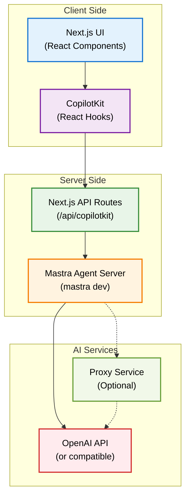

# CopilotKit <> Mastra Starter

This is a starter template for building AI agents using [Mastra](https://mastra.ai) and [CopilotKit](https://copilotkit.ai). It provides a modern Next.js application with integrated AI capabilities and a beautiful UI.

## Prerequisites

- Node.js 18+ 
- Any of the following package managers:
  - pnpm (recommended)
  - npm
  - yarn
  - bun

> **Note:** This repository ignores lock files (package-lock.json, yarn.lock, pnpm-lock.yaml, bun.lockb) to avoid conflicts between different package managers. Each developer should generate their own lock file using their preferred package manager. After that, make sure to delete it from the .gitignore.


## Architecture Overview

The following diagram shows how the different systems interact with each other:



## Getting Started

1. Add your OpenAI API key
```bash
# you can use whatever model Mastra supports
echo "OPENAI_API_KEY=your-key-here" >> .env
```

   If you are using a different API endpoint (for example, a local server or an alternative provider), also add the `OPENAI_BASE_URL` variable.

   **Using a Proxy Service:**
   
   If you need to use a proxy service to access OpenAI (for example, due to regional restrictions or corporate firewalls), you can configure it like this:
   
   ```bash
   # Example with a proxy service
   echo "OPENAI_API_KEY=your-key-here" >> .env
   echo "OPENAI_BASE_URL=https://your-proxy-service.com/v1" >> .env
   ```
   
   Popular proxy services include:
   - **OpenAI Proxy**: Self-hosted solutions like `openai-proxy`
   - **Azure OpenAI**: `https://your-resource.openai.azure.com/`
   - **Local AI servers**: Like `ollama`, `localai`, or `text-generation-webui`
   - **Corporate proxies**: Internal company endpoints


2. Install dependencies using your preferred package manager:
```bash
# Using pnpm (recommended)
pnpm install

# Using npm
npm install

# Using yarn
yarn install

# Using bun
bun install
```

2. Start the development server:
```bash
# Using pnpm
pnpm dev

# Using npm
npm run dev

# Using yarn
yarn dev

# Using bun
bun run dev
```


This will start the UI server. For full functionality, you also need to start the Mastra agent server in a separate terminal:

```bash
# Using pnpm
pnpm dev:agent

# Using npm
npm run dev:agent

# Using yarn
yarn dev:agent

# Using bun
bun run dev:agent
```

## Available Scripts
The following scripts can also be run using your preferred package manager:
- `dev` - Starts the UI server in development mode
- `dev:agent` - Starts the Mastra agent server
- `dev:debug` - Starts development servers with debug logging enabled
- `build` - Builds the application for production
- `start` - Starts the production server
- `lint` - Runs ESLint for code linting

## Documentation

- [Mastra Documentation](https://mastra.ai/en/docs) - Learn more about Mastra and its features
- [CopilotKit Documentation](https://docs.copilotkit.ai) - Explore CopilotKit's capabilities
- [Next.js Documentation](https://nextjs.org/docs) - Learn about Next.js features and API

## Contributing

Feel free to submit issues and enhancement requests!

## License

This project is licensed under the MIT License - see the LICENSE file for details.